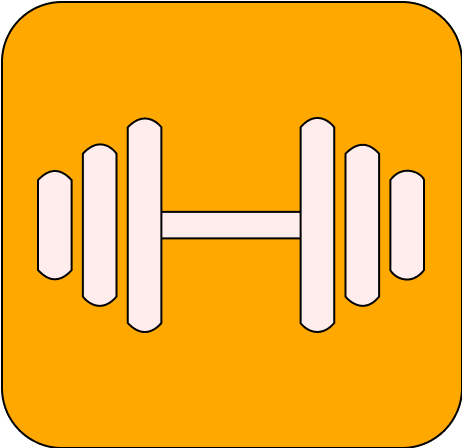

    

# Work It Out
Work It Out is a fitness application designed to help you exercise and become fit in the easiest way possible and is your go-to for all fitness needs!

## Why Work It Out?
Want to start exercising but don’t know how to? Want to tone your muscles, lose weight or simply stay fit? Then simply use this app and Work It Out.

With this simple and easy-to-use workout app, Work It Out would give you an incredible and enjoyable experience in working out.

We have many spectacular features such as the level feature, which gives the user experience points for each specific workout. When the user gains a specific amount of exp, he increases his level, which would be useful for a future update! This gamification feature increases the motivation of players to exercise, to unlock more levels, hence able to attract more users to use this app.

# Download Work It Out on the App Store Now!
